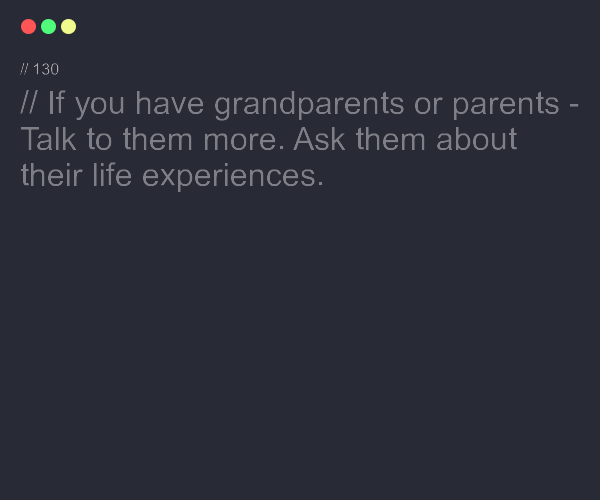

## Visão Geral
Essa API tem como objetivo gerar imagens a partir de mensagens de conselhos "advices" fornecidas por outra api disponivel [neste site](https://api.adviceslip.com/advice).

## Existem dois endpoints disponíveis:

`GET /advice`: Gera uma imagem com um conselho aleatório.
 
`GET /advice/:id`: Gera uma imagem com o conselho correspondente ao ID fornecido.

## Endpoints
`GET /advice`
### Esse endpoint gera uma imagem com um conselho aleatório.

### Parâmetros
Não há parâmetros para este endpoint.

### Resposta
Corpo da Resposta
Um arquivo PNG contendo a imagem com o conselho.

 

`GET /advice/:id`
Esse endpoint gera uma imagem com o conselho correspondente ao ID fornecido.

### Parâmetros
`id`: O ID do conselho a ser gerado.

### Resposta
Corpo da Resposta
Um arquivo PNG contendo a imagem com o conselho.

## Bibliotecas utilizadas
#### express: Framework web para Node.js.
#### jimp: Biblioteca para manipulação de imagens em Node.js.

## Rotinas Utilizadas
`findAdviceById(id: number)` Encontra um conselho por ID.
`randomAdvice()` Encontra um conselho aleatório.
